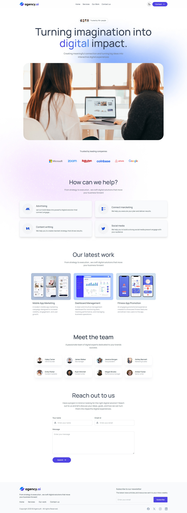
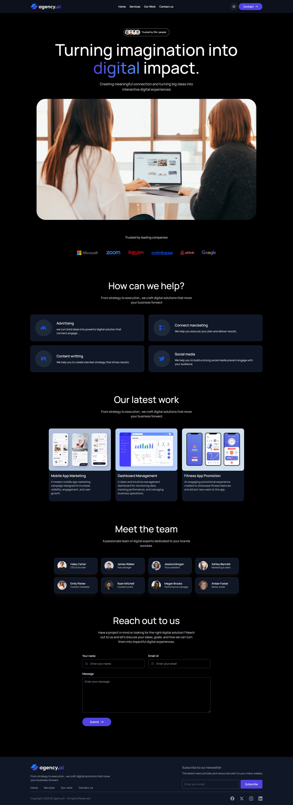

# 🚀 AgencyAI — Modern Digital Agency Website

A modern, responsive digital agency website built with **React.js** and **Tailwind CSS**.

This project focuses on creating a clean, professional, and visually engaging frontend experience with responsive layouts, dark mode, reusable React components, interactive sections, and a functional contact form.

---

### 🎥 Demo Video

[▶️ Watch Complete Frontend Demo](screenshots/demoVideo.mp4)

---

## 📸 Screenshot

### Light Mode



### Dark Mode



---

## 🌐 Live Demo

🔗 

---

## 📌 About the Project

**AgencyAI** is a modern digital agency website designed to present services, showcase completed work, introduce the team, and provide an easy way for visitors to contact the agency.

The project was built completely on the frontend using **React.js and Tailwind CSS**, with a focus on reusable components and responsive design.

---

## ✨ Features

- 🎨 Modern and clean UI
- ⚛️ Built with React.js
- 🎯 Tailwind CSS utility-first styling
- 📱 Fully responsive design
- 🌙 Light/Dark mode
- 💾 Theme preference stored using `localStorage`
- 🖥️ Responsive navigation with mobile sidebar
- 🏢 Trusted company section
- 💼 Services showcase
- 🚀 Latest work/projects section
- 👥 Team members section
- 📩 Functional contact form
- 🔔 Toast notifications using React Hot Toast
- 📧 Contact form submission using Web3Forms
- 🧩 Reusable React components
- 🎭 Responsive typography and spacing
- ✨ Hover and transition animations
- 📐 CSS Grid and Flexbox layouts

---

# 🛠️ Tech Stack

### Frontend

- **React.js**
- **JavaScript (ES6+)**
- **Tailwind CSS**
- **HTML5**
- **CSS3**

### Libraries & Services

- **React Hot Toast** — form success/error notifications
- **Web3Forms** — contact form submission
- **LocalStorage API** — theme persistence

### Development Tools

- **Vite**
- **VS Code**
- **Git & GitHub**

---

# 💡 Skills Demonstrated

Through this project, I demonstrated my ability to build **modern frontend websites using React.js and Tailwind CSS**.

### React.js

- Functional components
- Component-based architecture
- Props
- `useState`
- `useEffect`
- Rendering dynamic data using `.map()`
- Reusable components
- Conditional rendering
- Form handling
- Event handling

### Tailwind CSS

- Flexbox
- CSS Grid
- Responsive breakpoints
- Dark mode
- Typography
- Spacing
- Borders and shadows
- Gradients
- Hover effects
- Transitions
- Responsive navigation
- Custom utility values
- Layout positioning

### Frontend Development

I am able to create:

- Modern landing pages
- Digital agency websites
- Responsive business websites
- Portfolio websites
- Service-based websites
- Dark/light themed interfaces
- Responsive navigation systems
- Interactive contact forms
- Component-based React applications

This project demonstrates my ability to take a modern website design and implement it as a **responsive, reusable React frontend**.

---

# 🧩 Website Sections

## 1. Navigation Bar

The navigation bar includes:

- Responsive desktop navigation
- Mobile sidebar menu
- Light/Dark mode toggle
- Contact button
- Sticky positioning
- Backdrop blur effect

---

## 2. Hero Section

The hero section introduces the agency with:

- Main headline
- Gradient text
- Trusted user indicator
- Supporting description
- Responsive hero image
- Decorative background elements

---

## 3. Trusted By

Displays companies that trust the agency.

The company logos are dynamically rendered using:

```jsx
company_logos.map();
```

---

## 4. Services

The services section displays four services using reusable `ServiceCard` components.

Each card contains:

- Service icon
- Service title
- Service description

The cards use CSS Grid to create a responsive layout.

---

## 5. Our Work

Showcases the latest projects with:

- Project images
- Project titles
- Project descriptions
- Hover scaling effects
- Responsive grid layout

---

## 6. Team

Displays team members using reusable data-driven components.

Each team card includes:

- Profile image
- Name
- Job title
- Responsive layout

---

## 7. Contact Us

The contact section includes:

- Name input
- Email input
- Message textarea
- Form validation
- Web3Forms integration
- Success/error toast notifications

---

## 8. Footer

The footer contains:

- Agency logo
- Short description
- Navigation links
- Newsletter section
- Social media icons
- Copyright information

---

# 🌙 Dark Mode

The website supports both **Light Mode and Dark Mode**.

The theme is managed using React state:

```jsx
const [theme, setTheme] = useState(localStorage.getItem("theme") || "");
```

The selected theme is stored in the browser using:

```js
localStorage.setItem("theme", theme);
```

Tailwind's dark mode classes are then applied using the `dark` class on the HTML element.

Example:

```jsx
className = "bg-white dark:bg-gray-900 text-gray-700 dark:text-white";
```

This allows the entire website to dynamically adapt between light and dark themes.

---

# 📱 Responsive Design

The website is designed to work across different screen sizes.

Tailwind responsive utilities are used throughout the project:

```text
sm:
md:
lg:
xl:
max-sm:
```

Examples include:

```jsx
grid-cols-1 sm:grid-cols-2 lg:grid-cols-3
```

and:

```jsx
text-4xl sm:text-5xl md:text-6xl lg:text-[84px]
```

This allows the layout, typography, spacing, and navigation to adapt to different devices.

---

# 📂 Project Structure

```text
AgencyAI/
│
├── public/
│
├── src/
│   │
│   ├── assets/
│   │   ├── images/
│   │   ├── icons/
│   │   ├── logos/
│   │   └── assets.js
│   │
│   ├── Components/
│   │   ├── Navbar.jsx
│   │   ├── Hero.jsx
│   │   ├── TrustedBy.jsx
│   │   ├── Services.jsx
│   │   ├── ServiceCard.jsx
│   │   ├── OurWork.jsx
│   │   ├── Team.jsx
│   │   ├── ContactUs.jsx
│   │   ├── Footer.jsx
│   │   ├── Title.jsx
│   │   └── ThemeToggleBtn.jsx
│   │
│   ├── App.jsx
│   ├── main.jsx
│   └── index.css
│
├── .gitignore
├── package.json
├── vite.config.js
└── README.md
```

---

# 🔄 Component Architecture

The application follows a reusable component-based architecture.

```text
App
│
├── Navbar
│   └── ThemeToggleBtn
│
├── Hero
│
├── TrustedBy
│
├── Services
│   └── ServiceCard
│
├── OurWork
│
├── Team
│
├── ContactUs
│
└── Footer
```

This makes the application easier to maintain, update, and scale.

---

# ⚙️ Installation & Setup

Clone the repository:

```bash
git clone YOUR_GITHUB_REPOSITORY_URL
```

Navigate into the project:

```bash
cd AgencyAI
```

Install dependencies:

```bash
npm install
```

Start the development server:

```bash
npm run dev
```

Open the local development URL provided by Vite.

---

# 📦 Build for Production

Create a production build:

```bash
npm run build
```

Preview the production build:

```bash
npm run preview
```

---

# 🔐 Environment Variables

Environment variables for external services, create a `.env` file:

```env
VITE_YOUR_API_KEY=your_api_key_here
```

---

# 🚀 Deployment

This project can be deployed easily using platforms such as:

- Netlify
- Vercel
- GitHub Pages

---

# 🎯 What I Learned

Building this project helped me strengthen my understanding of:

- React component architecture
- Props and state management
- React hooks
- Dynamic rendering with `.map()`
- Tailwind CSS
- Responsive web design
- CSS Grid
- Flexbox
- Dark mode implementation
- LocalStorage
- Form handling
- API integration
- Toast notifications
- Reusable UI components
- Modern frontend development practices

---

# 🔮 Future Improvements

Possible future improvements include:

- Add backend integration
- Add CMS for managing projects and services
- Add authentication for an admin dashboard
- Add database integration
- Add newsletter subscription backend
- Add animations with Framer Motion
- Improve accessibility
- Add SEO optimization
- Add project detail pages
- Add real-time analytics

---

# 👨‍💻 Developer

**Sayan**

B.Tech CSE Student | Aspiring Software Engineer | MERN Stack Developer

This project represents my ability to build **modern, responsive, and visually polished frontend applications using React.js and Tailwind CSS**.

---

## ⭐ If you like this project

Feel free to ⭐ star the repository and explore the code to see how the website was built.

---

## 📄 License

This project is created for learning, portfolio, and educational purposes.
